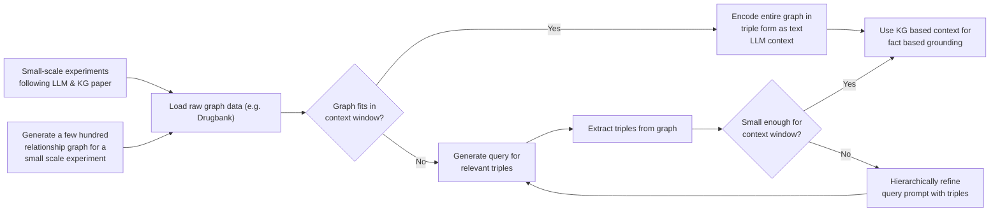

# graphbasedloading

## Introduction
This is a project from the CMU/DNAnexus Hackathon 2023, in which we are improving LLMs’ inferences for drug treatment recommendations by fine-tuning them with knowledge graphs.

## Research Motivation
Given that LLMs can answer queries quickly and efficiently, they could be useful in recommending drug treatments for various diseases, where time is of the essence. However, as their training data may be factually incorrect or outdated, LLMs are often unreliable in recommending drug treatments. 

Knowledge graphs can store factually correct relationships between data points, giving them the ability to answer complex queries. Hence, we believe that fine-tuning LLMs with knowledge graphs could aid LLMs in recommending drug treatments.

## Preliminary Workflow

## Methodology
### Dataset
38,617 drug-relationship-target triples were compiled from the Therapeutic Target Database [4], which are in “drug_relationship_target.csv”. URL to database: https://db.idrblab.net/ttd/ 

Below is a knowledge graph generated from 20 sample triples.

### Preprocessing
Using a self-written algorithm, the triples were preprocessed into a prompt-response format for finetuning LLAMA2. For instance, a sample prompt would be "[INST] Tell me more about the drug with ID D07OAC. [/INST]", and its corresponding response would be "Drug D07OAC is an inhibitor to target protein S5A2_HUMAN."

### Fine-tuning
Traditional fine-tuning approaches generally require retraining the last layers of the LLMs, which is computationally-expensive. To overcome this, we leveraged QLora, an efficient parameter tuning method that uses Low Rank Adaptation and Double Quantization to reduce training and inference costs. A LLMs-7B model was fine-tuned on our preprocessed data for 3 epochs. Training was done on a NVIDIA Tesla A100 and training time was approximately XXX hours.

### Deployment
Our fine-tuned model LLaMA2Glenda is deployed at https://huggingface.co/spaces/tminh/nexus

### Inference and Results
Finally, our fine-tuned model was benchmarked against ChatGPT and the original LLAMA2 model using the prompt "What can the drug with ID D0Y6UB do?". From the results, ChatGPT and the original LLAMA2 model were unable to respond to this prompt, whereas our fine-tuned model could suggest possible target proteins to the drug and the corresponding binding relationships.

ChatGPT's response:

Original LLAMA2's response:

## Related Works

### Jane: the Immunology Knowledge Assistant
This [application in immunology](https://rdilip-janewayq-a-main-rfx7el.streamlit.app/#jane-the-immunology-knowledge-assistant) is a large language model which was fed information from Janeway's Immunobiology and Organ Mapping Antibody Panels (OMAPs) from Human Reference Atlas Portal. Users can ask any immunology questions, but the input prompt influences the quality output/response. 

### original llma2-7b on HuggingFace
Here is the original [LLMA2-7B application](https://1916e37232cabeda6a.gradio.live/) available on HuggingFace where users can test the implementation for themselves. 

## Relevant Biomedical Knowledge Graphs
There is a vast set of resources, especially well-curated biomedical knowledge graphs, onto which similar applications can be built. 

| Knowledge Source | Open Source? | Date Released | URL       |
| ---------------- | ------------ | ------------- | --------- |
| PrimeKG          | Yes          | 2023          | [Link](https://zitniklab.hms.harvard.edu/projects/PrimeKG) / [Paper](https://www.nature.com/articles/s41597-023-01960-3) |
| PharmGKB         | Yes          | 2022          | [Link]() / [Paper]() |
| ROBOKOP          | Yes          | 2019          | [Link](https://robokop.renci.org/) / [Paper](https://pubs.acs.org/doi/10.1021/acs.jcim.9b00683) |
| Reactome Graph   | Yes          | 2018          | [Link](https://reactome.org/dev/graph-database) / [Paper](https://www.ncbi.nlm.nih.gov/pubmed/29377902) |
| Hetionet         | Yes          | 2017          | [Link](https://het.io) / [Paper](https://doi.org/10.7554/elife.26726) |
| DrugBank         | No           | 2008          | [Link](https://go.drugbank.com/) / [Paper](https://pubmed.ncbi.nlm.nih.gov/18048412/) |

## References
1. Pan, S., Luo, L., Wang, Y., Chen, C. et al. Unifying Large Language Models and Knowledge Graphs: A Roadmap. 20 June 2023, https://doi.org/10.48550/arXiv.2306.08302  
Tim Dettmers, Artidoro Pagnoni, Ari Holtzman, Luke Zettlemoyer. 

2. QLoRA: Efficient Finetuning of Quantized LLMs. 23 May 2023, https://arxiv.org/pdf/2305.14314.pdf  

3. Edward J. Hu, Yelong Shen, Phillip Wallis, Zeyuan Allen-Zhu, Yuanzhi Li, Shean Wang, Lu Wang, Weizhu Chen. LoRA: Low-Rank Adaptation of Large Language Models, https://arxiv.org/pdf/2106.09685.pdf 

4. Y. Zhou, Y. T. Zhang, D. H. Zhao, X. Y. Yu, X. Y. Shen, Y. Zhou, S. S. Wang , Y. Q. Qiu*, Y. Z. Chen* & F. Zhu* . TTD: Therapeutic Target Database describing target druggability information. Nucleic Acids Research. doi: 10.1093/nar/gkad751 (2023). PMID: 37713619
