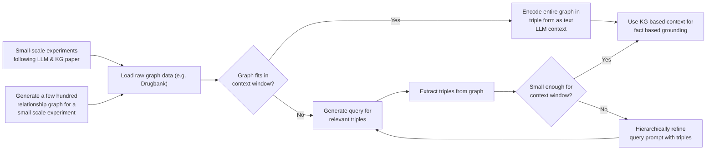

# graphbasedloading

## Introduction
This is a project from the CMU/DNAnexus Hackathon 2023, in which we are improving LLMs’ inferences for drug treatment recommendations by fine-tuning them with knowledge graphs.

## Research Motivation
Given that LLMs can answer queries quickly and efficiently, they could be useful in recommending drug treatments for various diseases, where time is of the essence. However, as their training data may be factually incorrect or outdated, LLMs are often unreliable in recommending drug treatments. 

Knowledge graphs can store factually correct relationships between data points, giving them the ability to answer complex queries. Hence, we believe that fine-tuning LLMs with knowledge graphs could aid LLMs in recommending drug treatments.

## Preliminary Workflow

## Methodology
**Dataset**: We compiled 44,663 drug-relationship-target triplets from the xxx database, which are in “drug_relationship_target.csv”.

**Preprocessing**: The triplets were preprocessed into a prompt-response format for LLAMA2, see “inputdata.txt”. Sample: '<s>[INST] Tell me more about the drug with ID D07OAC. [/INST] Drug D07OAC is an inhibitor to target protein S5A2_HUMAN. </s>'

<!-- Training and Inference: A LLAMA2-7b model was then fine-tuned on the preprocessed data. -->
**Fine-tuning**: Within fine-tuning techniques, traditional approach usually requires retraining the last layers of the LLMs which would cost a huge amount of computational cost. For your experiement, we used a technique called QLora which is a efficient parameter tuning method that use Low Rank Adaptation and Double Quantization to reduce the training and inferencing cost. Using the knowledge graph dataset represented as triplets as showed above, we were able to fine tune LLMs-7B on a NVIDIA Tesla A100 within 2 hours.

**Deployment**: We were above to deploy our fine-tuned model LLaMA2Glenda at https://huggingface.co/spaces/tminh/nexus

**Inference**: The last step of the benchmarking step is to conduct experiements as show (should be replaced with our work) [here](https://github.com/tanchongmin/TensorFlow-Implementations/blob/main/Tutorial/LLM%20with%20Knowledge%20Graphs.ipynb)

## References
Pan, S., Luo, L., Wang, Y., Chen, C. et al. Unifying Large Language Models and Knowledge Graphs: A Roadmap. 20 June 2023, https://doi.org/10.48550/arXiv.2306.08302
Tim Dettmers, Artidoro Pagnoni, Ari Holtzman, Luke Zettlemoyer. QLoRA: Efficient Finetuning of Quantized LLMs. 23 May 2023, https://arxiv.org/pdf/2305.14314.pdf
Edward J. Hu, Yelong Shen, Phillip Wallis, Zeyuan Allen-Zhu, Yuanzhi Li, Shean Wang, Lu Wang, Weizhu Chen. LoRA: Low-Rank Adaptation of Large Language Models, https://arxiv.org/pdf/2106.09685.pdf