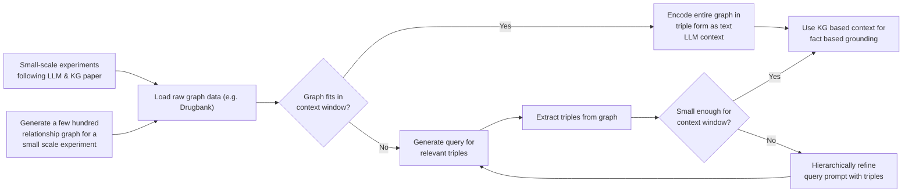

# graphbasedloading
This project was developed at the **2023 Carnegie Mellon & DNAnexus Hackathon** hosted on October 19th to 21st, 2023. Scientists across the country worked together in-person and remotely to advance applications in data management and graph extraction for large models in the biomedical space.

## Team
Our team came together from multiple locations. 
* Emerson Huitt @ Raleigh, NC
* Glenda Tan @ Pittsburgh, PA
* Minh Tran @ Pittsburgh, PA
* Mingyue (Phoebe) Li @ Pittsburgh, PA
* David Enoma @ Canada
* Van Truong @ Philadelphia, PA

## Background
Given that LLMs can answer queries quickly and efficiently, they could be useful in recommending drug treatments for various diseases, where time is of the essence. However, as their training data may be factually incorrect or outdated, large-language models (LLMs) are often unreliable in recommending drug treatments. 

Knowledge graphs can store factually correct relationships between data points, giving them the ability to answer complex queries. Hence, we believe that fine-tuning LLMs with knowledge graphs can aid LLMs in drug treatment recommendations.

## Research Motivation
Our project aims to improve the inference ability of LLMs for generating recommendations on drug treatment. We constructed a knowledge graph catered to therapeutics and then fine-tuned the LLM on the information network. 

## Initial Brainstorming

## Final Workflow

## Methodology
### Dataset
38,617 drug-relationship-target triples were compiled from the Therapeutic Target Database [4], which are in “drug_relationship_target.csv”. URL to database: https://db.idrblab.net/ttd/ 

Below is a knowledge graph generated from 20 sample triples.

### Preprocessing
Using a self-written algorithm, the triples were preprocessed into a prompt-response format for finetuning LLAMA2. For instance, a sample prompt would be "[INST] Tell me more about the drug with ID D07OAC. [/INST]", and its corresponding response would be "Drug D07OAC is an inhibitor to target protein S5A2_HUMAN."

### Fine-tuning
Traditional fine-tuning approaches generally require retraining the last layers of the LLMs, which is computationally-expensive. To overcome this, we leveraged QLora, an efficient parameter tuning method that uses Low Rank Adaptation and Double Quantization to reduce training and inference costs. A LLMs-7B model was fine-tuned on our preprocessed data for 3 epochs. Training was done on a NVIDIA Tesla A100 and training time was approximately 3 hours.

### Deployment
Our fine-tuned model LLaMA2Glenda is deployed at https://huggingface.co/tminh/llama-2-7b-glendalorian

### Inference and Results
Finally, our fine-tuned model was benchmarked against ChatGPT and the original LLAMA2 model using the prompt "What can the drug with ID D0Y6UB do?". From the results, ChatGPT and the original LLAMA2 model were unable to respond to this prompt, whereas our fine-tuned model could suggest possible target proteins to the drug and the corresponding binding relationships.

**ChatGPT's response:**

**Original LLAMA2's response:**

**Our fine-tuned LLAMA2's response:**
_Currently in progress_

## Future Directions
The landscape of well-curated biomedical knowledge graphs is vast. In the future, we plan to fine-tune LLMs onto additional biomedical KGs, enabling LLMs to answer a wider range of treatment-related queries.

| Knowledge Source | Open Source? | Date Released | URL       |
| ---------------- | ------------ | ------------- | --------- |
| Petagraph        | Yes          | 2023          | [Link](https://docs.rs/petgraph/latest/petgraph/) / [Paper](https://www.biorxiv.org/content/biorxiv/early/2023/02/13/2023.02.11.528088.full.pdf) | 
| PrimeKG          | Yes          | 2023          | [Link](https://zitniklab.hms.harvard.edu/projects/PrimeKG) / [Paper](https://www.nature.com/articles/s41597-023-01960-3) |
| RTX-KG2         | Yes          | 2022          | [Link](https://github.com/RTXteam/RTX-KG2) / [Paper](https://doi.org/10.1186/s12859-022-04932-3) |
| Drug Repurposing Knowledge Graph | Yes | 2021    | [Link](https://github.com/gnn4dr/DRKG) / [Paper](https://pubmed.ncbi.nlm.nih.gov/33571675/) |
| ROBOKOP          | Yes          | 2019          | [Link](https://robokop.renci.org/) / [Paper](https://pubs.acs.org/doi/10.1021/acs.jcim.9b00683) |
| Reactome Graph   | Yes          | 2018          | [Link](https://reactome.org/dev/graph-database) / [Paper](https://www.ncbi.nlm.nih.gov/pubmed/29377902) |
| Hetionet         | Yes          | 2017          | [Link](https://het.io) / [Paper](https://doi.org/10.7554/elife.26726) |
| DrugBank         | No           | 2008          | [Link](https://go.drugbank.com/) / [Paper](https://pubmed.ncbi.nlm.nih.gov/18048412/) |

## References
1. Pan, S., Luo, L., Wang, Y., Chen, C. et al. Unifying Large Language Models and Knowledge Graphs: A Roadmap. 20 June 2023, https://doi.org/10.48550/arXiv.2306.08302  

2. Tim Dettmers, Artidoro Pagnoni, Ari Holtzman, Luke Zettlemoyer. QLoRA: Efficient Finetuning of Quantized LLMs. 23 May 2023, https://arxiv.org/pdf/2305.14314.pdf  

3. Edward J. Hu, Yelong Shen, Phillip Wallis, Zeyuan Allen-Zhu, Yuanzhi Li, Shean Wang, Lu Wang, Weizhu Chen. LoRA: Low-Rank Adaptation of Large Language Models, https://arxiv.org/pdf/2106.09685.pdf 

4. Y. Zhou, Y. T. Zhang, D. H. Zhao, X. Y. Yu, X. Y. Shen, Y. Zhou, S. S. Wang , Y. Q. Qiu*, Y. Z. Chen* & F. Zhu* . TTD: Therapeutic Target Database describing target druggability information. Nucleic Acids Research. doi: 10.1093/nar/gkad751 (2023). PMID: 37713619

5. Stear, B. J., Ahooyi, T. M., Vasisht, S., Simmons, A., Beigel, K., Callahan, T. J., Silverstein, J. C., &amp; Taylor, D. M. (2023, January 1). Petagraph: A large-scale unifying knowledge graph framework for integrating biomolecular and biomedical data. bioRxiv. https://www.biorxiv.org/content/10.1101/2023.02.11.528088v1 

6. Tian, Y., Song, H., Wang, Z., Wang, H., Hu, Z., Wang, F., Chawla, N. V., &amp; Xu, P. (2023). Graph Neural Prompting with Large Language Models (arXiv:2309.15427). arXiv. https://doi.org/10.48550/arXiv.2309.15427

