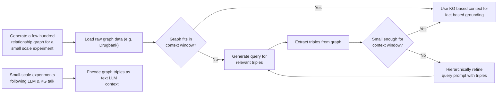

# graphbasedloading

## Preliminary Workflow

```mermaid
graph LR;
  A["Small-scale experiments
  following LLM & KG talk"]
  B["Generate a few hundred
   relationship graph for a
   small scale experiment"]
  D["Load raw graph data (e.g. Drugbank)"]
  C["Encode graph triples as text LLM
     context"]
  X["Use KG based context for
fact based grounding"]
  E{"Graph fits in
context window?"}
  F["Generate query for
 relevant triples"]
  G["Extract triples from graph"]
  H{"Small enough for
context window?"}
  I["Hierarchically refine
query prompt with triples"]
  A-->C
  B-->D
  D-->E
  E-->|Yes|X
  E-->|No|F
  F-->G
  G-->H
  H-->|Yes|X
  H-->|No|I
  I-->F
```
